# Portfolio Projects
## Following are my projects in SQL, Python, Tableau & Excel:  

- [x] **SQL & Tableau** - 
  - Instagram Clone Data Analysis Project 

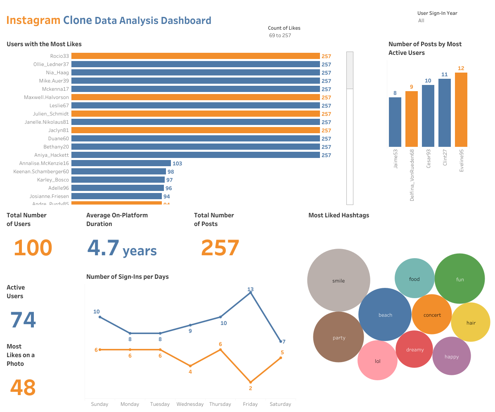

- [x] **Hadoop (Hive)** - 
  - NYC Yellow Taxi Records: Data Analysis  

- [x] **SQL** - 
  - Nashville Housing Dataset: Data Cleaning  

  - COVID-19 Dataset: Data Exploration   

- [x] **PostgreSQL** - 
  - Business Intelligence Challenge  

- [x] **Python** - 
  - Movies Industry Dataset: Exploratory Data Analysis Project  

- [x] **Tableau** - 

  

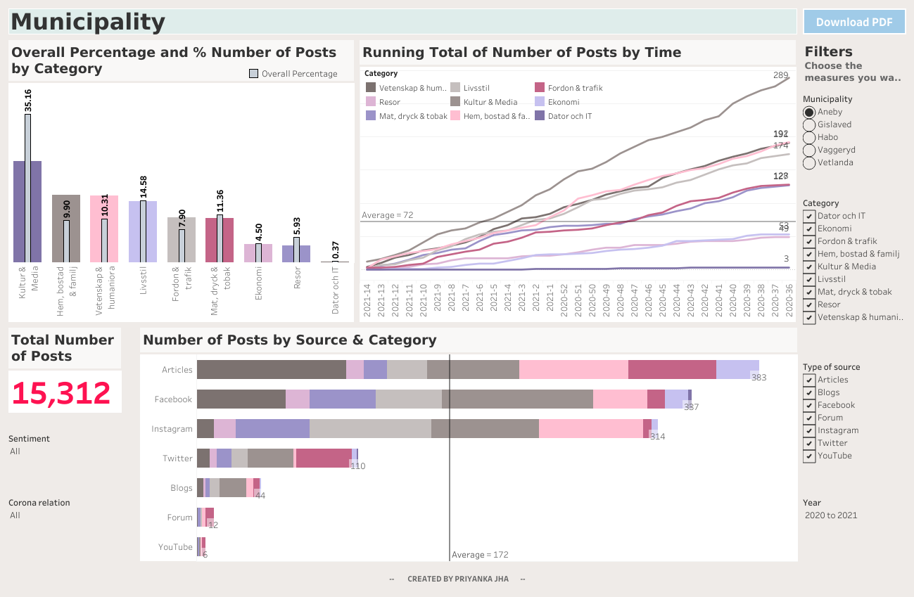  

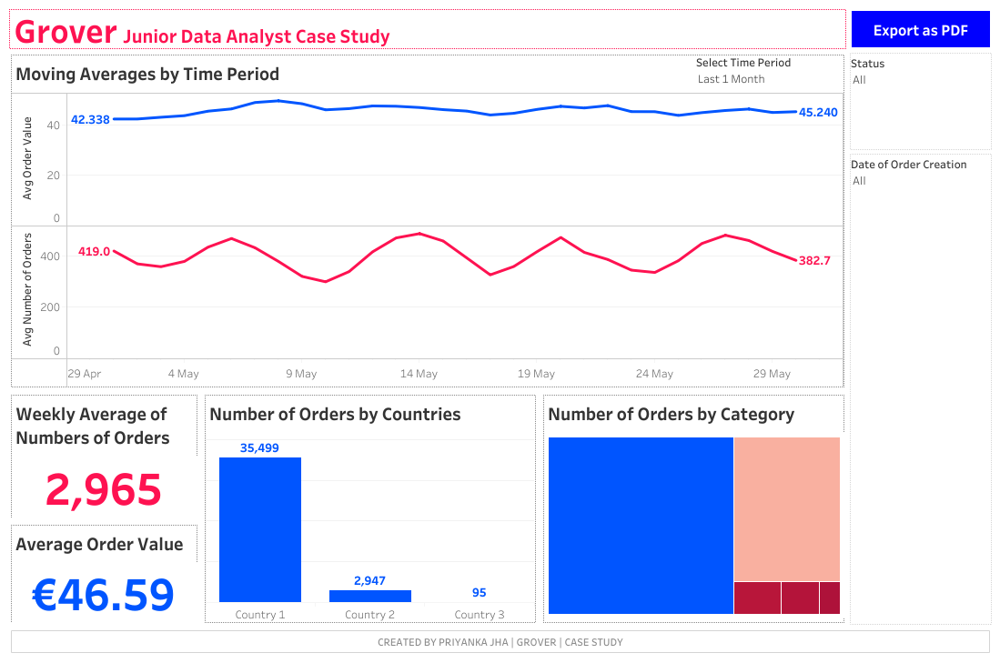  

      
      1 KPI Dashboard

      2 Top-Down Dashboard
      

      3 Q&A Dashboard
      

      4 Bottom-Up Dashboard
      
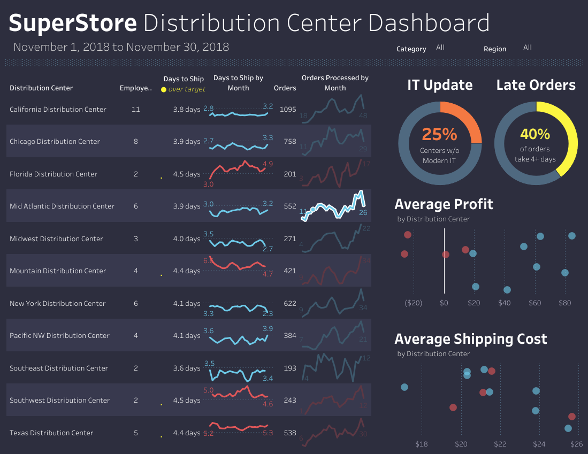

      5 Geo Chart
      
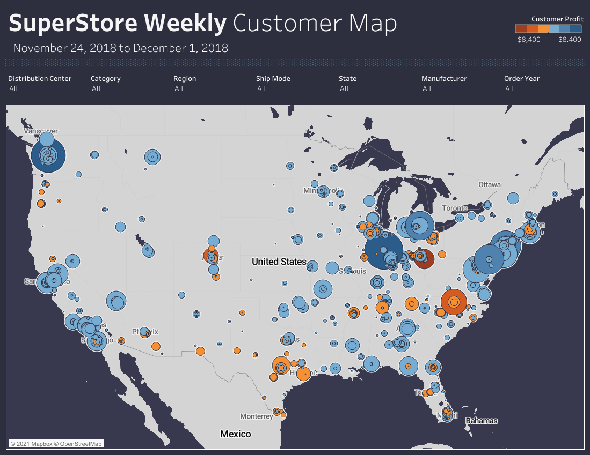

- [x] **Excel** - 

*Kindly download these Excel files from this repository and view them in Microsoft Excel.*

- Sales Superstore Sample: Sales Performance Dashboard  

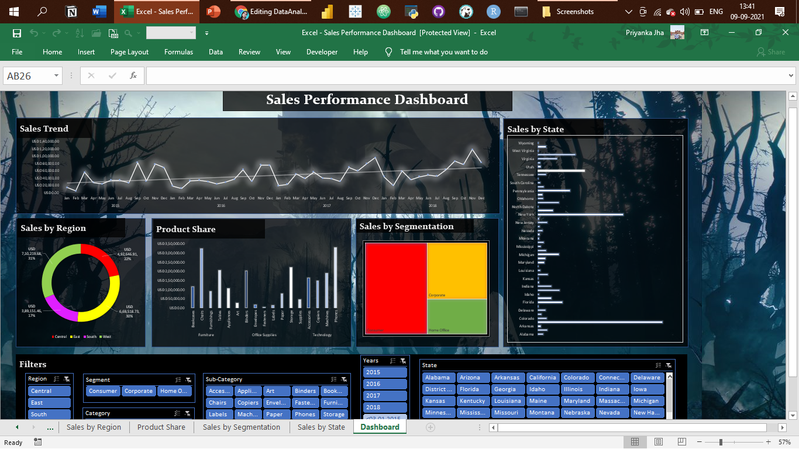

- NetTRON Network Infrastructure Data : LOOKUP, INDEX, MATCH, SUMIFS  

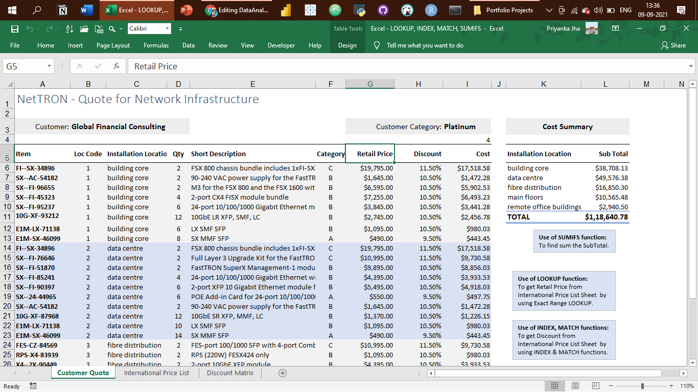

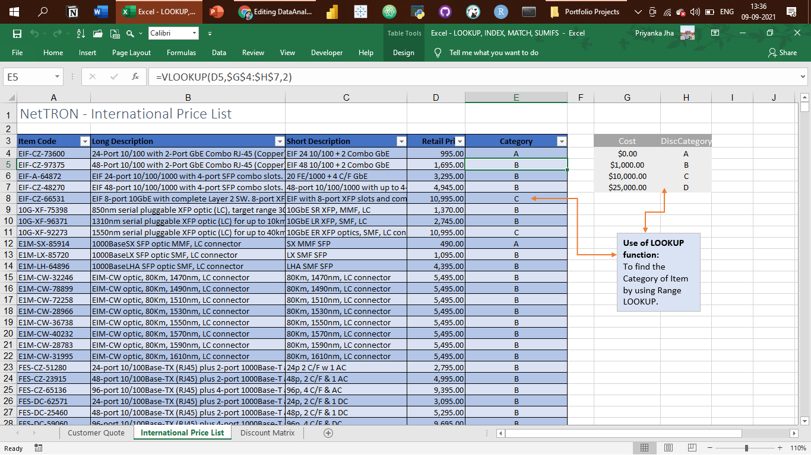

- Shipping Data: Pivot Tables, Pivot Chart, Slicers  

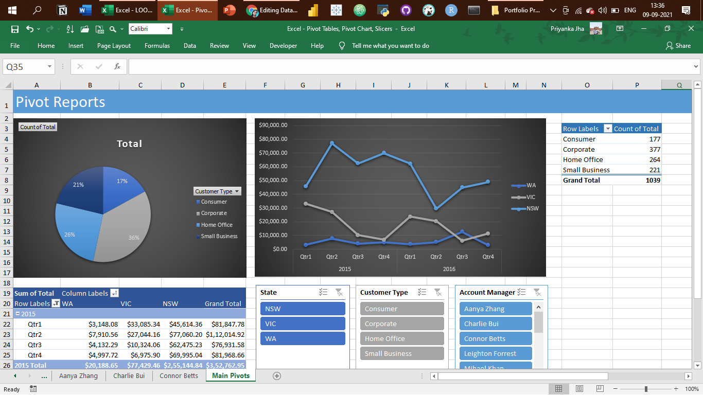

- Project Costing Model Data: Scenario Manager, Solver (Data Modeling)

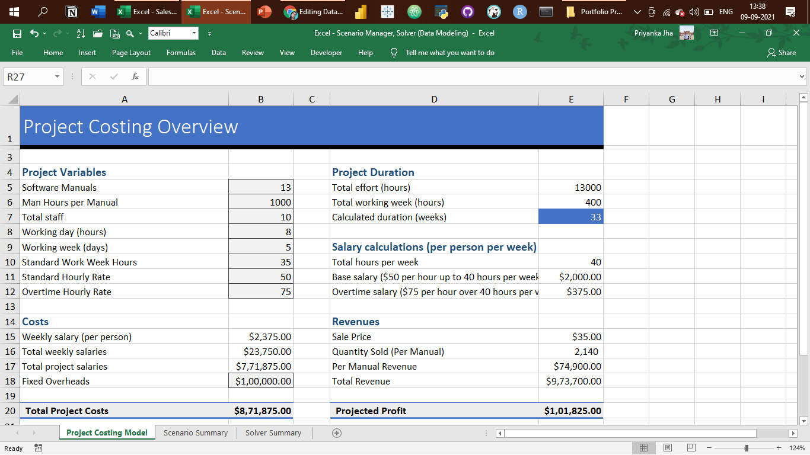

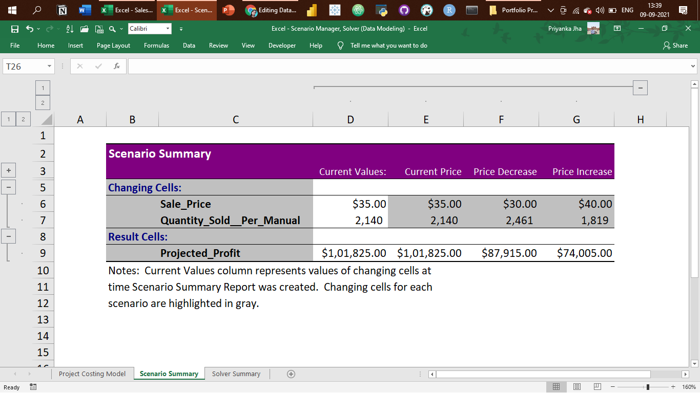

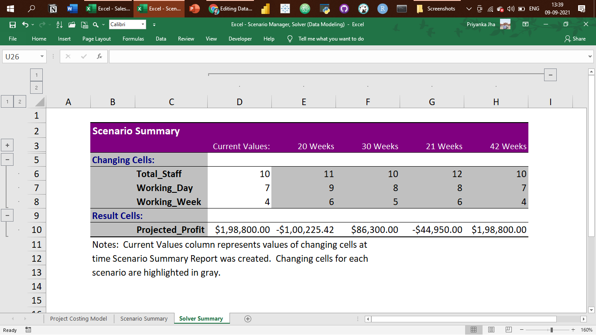

--------------------------------------------------------------------------------------------------------------------------------------------------------------------------------
